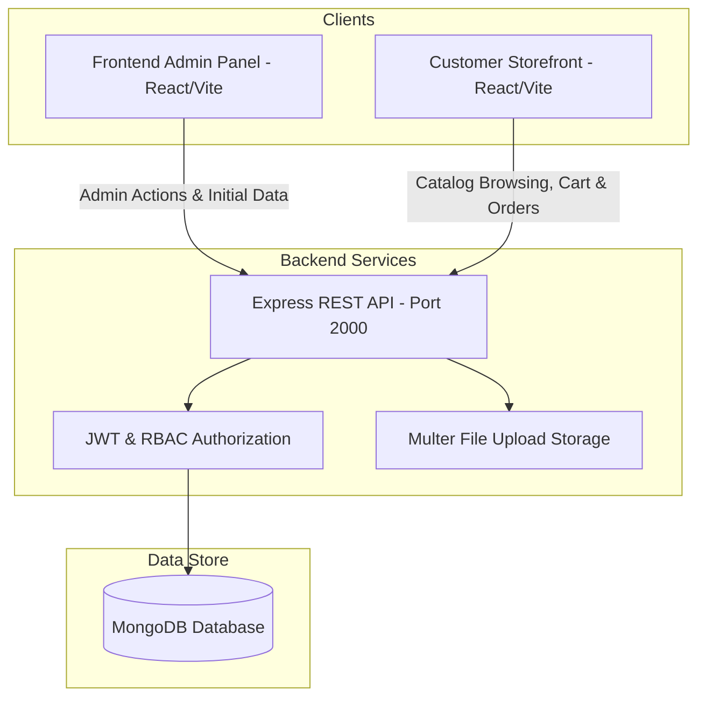

# 🛒 Flipkart Clone - Full-Stack E-Commerce Enterprise Platform

[] mern/2_flipcard/backend)
[] mern/2_flipcard/backend)
[] mern/2_flipcard/frontend-admin-app)
[] mern/2_flipcard/frontend-app-clone)

A production-grade, full-stack e-commerce ecosystem built with **Node.js, Express, MongoDB, React 18, and Redux Toolkit**. This platform replicates core enterprise e-commerce functionality, including multi-tier recursive category tree management, multi-image product uploading, custom admin page layout builders, atomic shopping cart synchronization, multi-step checkout, and real-time order status tracking.

---

## 📚 Project Documentation Hub

All modules are extensively documented. Access the detailed technical guides below:

📁 **[`README/`] mern/2_flipcard/README)** Directory Breakdown:
- 📖 [**Project Overview & System Architecture**] mern/2_flipcard/README/PROJECT_OVERVIEW.md)
- 🛠️ [**Backend REST API & Database Documentation**] mern/2_flipcard/README/BACKEND_DOCUMENTATION.md)
- 🖥️ [**Frontend Admin Dashboard Documentation**] mern/2_flipcard/README/FRONTEND_ADMIN_DOCUMENTATION.md)
- 🛒 [**Frontend Customer Storefront Documentation**] mern/2_flipcard/README/FRONTEND_APP_CLONE_DOCUMENTATION.md)

---

## 🌟 Key Architecture Highlights



### 1️⃣ Backend API Service (`/backend`)
- **JWT & Role-Based Access Control**: Secure endpoints partitioned by `user`, `admin`, and `super-admin` roles.
- **Recursive Category Hierarchy**: Dynamic parent-child tree generator (`createCategories`) supporting unlimited nesting depth.
- **Multer File Storage**: Disk and S3 file upload engines handling product images, category icons, and promo banners.
- **Atomic Database Operations**: Mongoose `findOneAndUpdate` with `upsert` and MongoDB array manipulation (`$push`, `$set`, `$pull`).

### 2️⃣ Admin Control Dashboard (`/frontend-admin-app`)
- **Single Request Initial Data Hydration**: Fetches categories, products, and customer orders in 1 API roundtrip upon load.
- **Interactive Category Tree**: Checkbox tree view (`react-checkbox-tree`) for modal-driven batch category updates and deletions.
- **Page Builder**: Custom category promotional page creator with banner image uploading and destination routing.
- **Order Pipeline Manager**: Update customer order fulfillment stage (`ordered` ➔ `packed` ➔ `shipped` ➔ `delivered`).

### 3️⃣ Customer Storefront App (`/frontend-app-clone`)
- **Dynamic Category Navigation**: Top navigation menu dynamically built from recursive category hierarchy.
- **Smart Product Grouping**: Product listing by category slug automatically segmented into price range buckets (`< $1k`, `< $3k`, `< $4k`, `< $5k`, `< $7k`).
- **Synchronized Cart**: Guest cart auto-merging with database upon user login.
- **4-Step Guided Checkout**: Authentication ➔ Address selection/creation ➔ Order item summary ➔ Payment selection (COD / Card).
- **Visual Order Tracker**: Real-time step tracker showing order status progression.

---

## 📁 Repository Directory Map

```
2_flipcard/
├── README/
│   ├── PROJECT_OVERVIEW.md               # Complete System Architecture & Setup
│   ├── BACKEND_DOCUMENTATION.md          # REST API Endpoints & Database Schemas
│   ├── FRONTEND_ADMIN_DOCUMENTATION.md   # Admin Panel Architecture & State Flow
│   └── FRONTEND_APP_CLONE_DOCUMENTATION.md# Customer App Architecture & Features
├── backend/                              # Node.js Express REST API
│   ├── README.md                         # Backend README
│   └── src/                              # Backend Controllers, Models, Routes, Middlewares
├── frontend-admin-app/                    # Admin Dashboard Application
│   ├── README.md                         # Admin App README
│   └── src/                              # Admin Containers, Components, Redux Slices
└── frontend-app-clone/                    # Customer E-Commerce Storefront
    ├── README.md                         # Customer App README
    └── src/                              # Customer Containers, Components, Redux Slices
```

---

## ⚡ Quick Start & Run Guide

### 1️⃣ Start Backend API Server
```bash
cd backend
npm install
npm start
```
*Server starts on `http://localhost:2000`*

### 2️⃣ Start Admin Dashboard
```bash
cd frontend-admin-app
npm install
npm run dev
```
*Admin Dashboard opens on `http://localhost:5173`*

### 3️⃣ Start Customer Storefront
```bash
cd frontend-app-clone
npm install
npm run dev
```
*Customer App opens on `http://localhost:5174`*

---

## 📜 License & Portfolio Usage

This repository is maintained as a full-stack engineering portfolio demonstration. All source code is written to industry standards with modular components, comprehensive validation, clean RESTful standards, and production-ready error handling.
