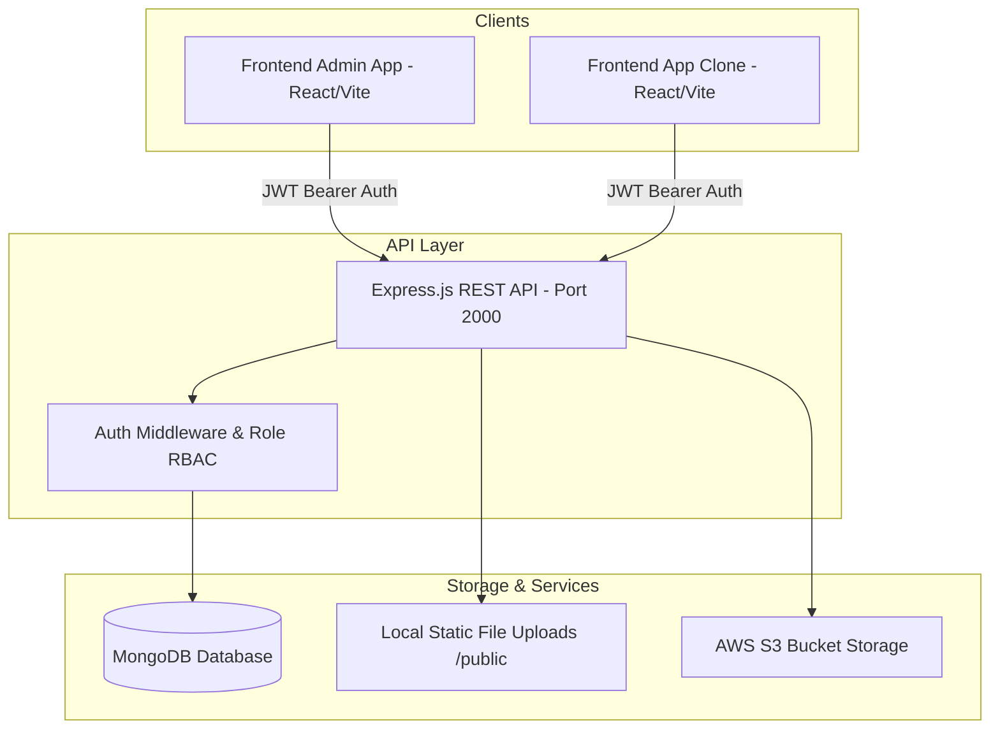

# 🚀 Flipkart Clone - Full-Stack E-Commerce Platform

Welcome to the comprehensive documentation of the **Flipkart Clone E-Commerce Platform**. This repository contains a production-ready, full-stack e-commerce solution comprising a robust RESTful API backend, a feature-rich Admin Dashboard, and a modern Customer Storefront application.

---

## 📌 Ecosystem Overview

The platform is structured into three distinct services working seamlessly together:

| Service                 | Directory             | Tech Stack                                       | Role & Purpose                                                                                                                                                                        |
| :---------------------- | :-------------------- | :----------------------------------------------- | :------------------------------------------------------------------------------------------------------------------------------------------------------------------------------------ |
| **Backend API**         | `backend/`            | Node.js, Express, MongoDB, Mongoose, JWT, Multer | RESTful API server handling authentication, nested category hierarchy, products, dynamic landing pages, shopping cart, user addresses, and order management.                          |
| **Admin Dashboard**     | `frontend-admin-app/` | React, Redux Toolkit, React-Bootstrap, Vite      | Control panel for administrators to manage categories, products, customized page layouts (banners & offer sections), and track/update customer order statuses.                        |
| **Customer Storefront** | `frontend-app-clone/` | React, Redux Toolkit, CSS, Vite                  | E-commerce web shop enabling users to browse category trees, filter products by price ranges, view product detail pages, manage cart items, add delivery addresses, and place orders. |

---

## 🏗 System Architecture



---

## ⚙️ Key Technical Features

### 🛡️ Authentication & Role-Based Access Control (RBAC)
- Multi-role authorization (`user`, `admin`, `super-admin`).
- Secure JWT (JSON Web Token) based authentication header validation.
- Password encryption using `bcrypt` (10 salt rounds).
- First registered admin automatically assigned `super-admin` status.

### 📁 Dynamic Recursive Category Hierarchy
- Unlimited multi-level nested categories (e.g., *Electronics* ➔ *Mobile* ➔ *Samsung*).
- Recursive category structure generated dynamically on server queries.
- Automated URL-friendly slug creation with `slugify`.
- Category image attachment support.

### 🛍️ Product Catalog & Price Tiering
- Support for multiple high-resolution product image uploads via `multer`.
- Categorized product queries with automated price-tier grouping (`< $1,000`, `< $3,000`, `< $4,000`, `< $5,000`, `< $7,000`).
- Detailed product specification management and inventory quantity control.

### 🎨 Custom Admin Page Builder
- Admin portal capability to build category-specific promotional landing pages.
- Multi-banner file upload support with interactive route target navigation.

### 🛒 Real-time Cart & Checkout Flow
- Atomic MongoDB cart updates (`upsert` & `$push`/`$set` queries).
- Multi-address delivery ledger for users.
- Order creation pipeline automatically deleting active cart state upon successful placement.
- Step-by-step order tracking timeline (`ordered` ➔ `packed` ➔ `shipped` ➔ `delivered`).

---

## 💻 Technical Stack

- **Runtime**: Node.js v16+
- **Backend Framework**: Express.js
- **Database**: MongoDB with Mongoose ORM
- **Frontend Core**: React 18 with Vite
- **State Management**: Redux Toolkit & React-Redux
- **Styling**: Bootstrap, React-Bootstrap, Vanilla CSS
- **Authentication**: `jsonwebtoken`, `bcrypt`
- **File Uploads**: `multer`, `multer-s3`, `aws-sdk`
- **Validation**: `express-validator`

---

## 📁 Repository Directory Map

```
4_RizwanKhanFlipCard/
├── README/
│   ├── PROJECT_OVERVIEW.md               # Architecture & Ecosystem Overview
│   ├── BACKEND_DOCUMENTATION.md          # Deep Dive REST API & Database Docs
│   ├── FRONTEND_ADMIN_DOCUMENTATION.md   # Admin Panel Architecture & Guide
│   └── FRONTEND_APP_CLONE_DOCUMENTATION.md# Customer App Architecture & Guide
├── README.md                             # Repository Master README
├── backend/                              # Node.js / Express Server
│   ├── README.md                         # Backend README
│   └── src/
│       ├── common-middleware/            # JWT & RBAC & Multer Middlewares
│       ├── controllers/                  # API Controllers (Auth, Product, Category, Cart, Order, Page)
│       ├── models/                       # Mongoose Schemas
│       ├── routes/                       # Express Endpoints
│       ├── utils/                        # Token & Helper utilities
│       └── validators/                   # Input validation rules
├── frontend-admin-app/                    # React Admin Control Dashboard
│   ├── README.md                         # Admin App README
│   └── src/                              # React Source Code (Components, Containers, Redux)
└── frontend-app-clone/                    # React Customer Storefront App
    ├── README.md                         # Storefront App README
    └── src/                              # React Source Code (Components, Containers, Redux)
```

---

## ⚡ Quick Start & Installation Guide

### Prerequisites
- Node.js (v16.x or later)
- MongoDB running locally on `mongodb://localhost:27017` or MongoDB Atlas URI.

---

### 1️⃣ Setting Up the Backend

```bash
cd backend
npm install
```

Create a `.env` file in `backend/`:
```env
PORT=2000
MONGO_DB_URL=mongodb://localhost:27017/flipkart_clone
JWT_SECRET=your_super_secret_jwt_key
accessKeyId=YOUR_AWS_ACCESS_KEY_ID (Optional)
secretAccessKey=YOUR_AWS_SECRET_KEY (Optional)
```

Start the backend server:
```bash
npm start
```
The server will start on `http://localhost:2000`.

---

### 2️⃣ Setting Up the Admin Dashboard

```bash
cd frontend-admin-app
npm install
npm run dev
```
The admin app will launch on `http://localhost:5173` (or available Vite port).

---

### 3️⃣ Setting Up the Customer Storefront

```bash
cd frontend-app-clone
npm install
npm run dev
```
The customer storefront will launch on `http://localhost:5174` (or available Vite port).

---

## 📄 Detailed Documentation Modules

For detailed breakdowns of each module, inspect the dedicated guides in the `README/` folder:

- 🔗 [Backend API & Database Documentation] 4_RizwanKhanFlipCard/README/BACKEND_DOCUMENTATION.md)
- 🔗 [Frontend Admin Dashboard Documentation] 4_RizwanKhanFlipCard/README/FRONTEND_ADMIN_DOCUMENTATION.md)
- 🔗 [Frontend Customer Storefront Documentation] 4_RizwanKhanFlipCard/README/FRONTEND_APP_CLONE_DOCUMENTATION.md)
